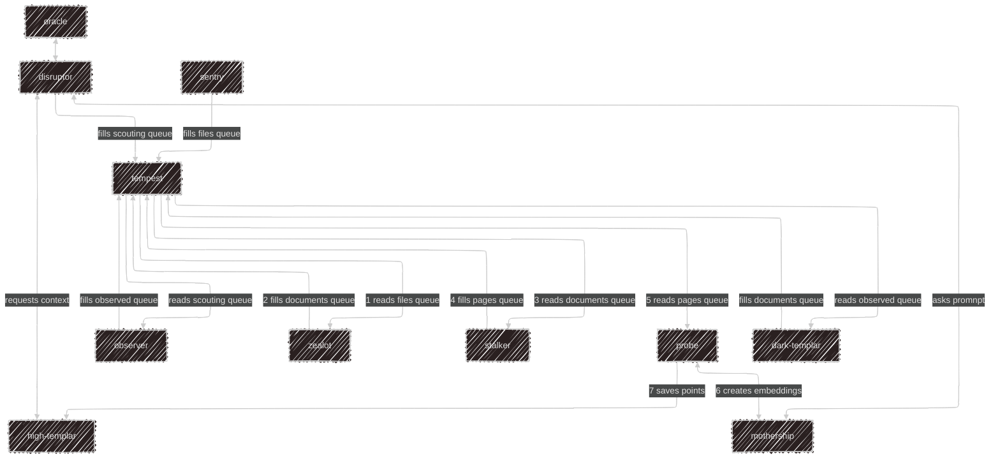
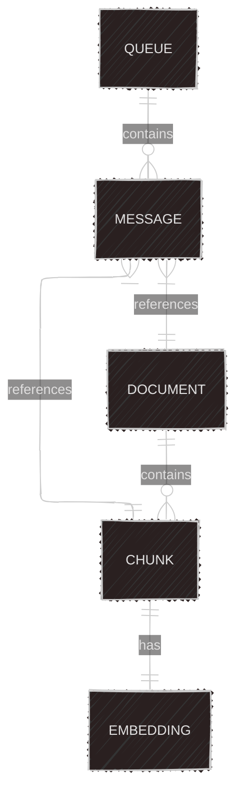

# Architecture

## Project Folder Structure
```
protoss/
├── assimilator/              # Redis container code
├── cybernetics_core/         # File watcher container code
├── dark_shrine/             # Data parser container code
├── fleet_beacon/            # Ollama container code
├── gateway/                 # Document extractor container code
├── nexus/                   # Embedding creator container code
├── pylon/                   # Shared container application code
├── robotics_bay/            # API container code
├── robotics_facility_warps/ # Scraper container code
├── stargate/                # File upload directory
│   └── warp_gate/          # Processed files directory
├── stasis_ward/             # Frontend container code
├── templar_archives/        # Qdrant container files
└── twilight_council/        # Document chunker container code
```

## Architecture Diagram


### System Flow
1. Files are uploaded to the `stargate` directory
2. Sentry detects new files and adds them to the files queue
3. Zealot processes files into documents
4. Stalker chunks documents into pages
5. Probe creates embeddings and stores them in Qdrant
6. Oracle provides UI for user interaction
7. Observer handles web scraping tasks
8. Dark-Templar processes scraped data
9. Disruptor manages API endpoints
10. Mothership handles AI model inference

### Redis Queues
- `files`: New file notifications
- `documents`: Extracted document data
- `pages`: Chunked document pages
- `scouting`: Web scraping tasks
- `observed`: Scraped data

### System Components Description
- **Mothership**: AI model service (Ollama)
- **High-Templar**: Vector database service (Qdrant)
- **Tempest**: Redis queue service
- **Sentry**: File watcher service
- **Zealot**: Document extractor service
- **Stalker**: Document chunker service
- **Probe**: Embedding creator service
- **Disruptor**: API service
- **Oracle**: Frontend UI service
- **Observer**: Web scraper service
- **Dark-Templar**: Data parser service

#### Core Services
1. **Mothership (AI Model Service)**
   - Runs the Ollama AI model
   - Handles inference requests
   - Creates embeddings for documents

2. **High-Templar (Vector Database)**
   - Runs Qdrant vector database
   - Stores and retrieves document embeddings
   - Handles similarity searches

3. **Tempest (Queue Service)**
   - Runs Redis queues
   - Manages message passing between services
   - Handles queue persistence

4. **Sentry (File Watcher)**
   - Monitors upload directory
   - Detects new files
   - Adds files to processing queue

5. **Zealot (Document Extractor)**
   - Processes uploaded files
   - Extracts text content
   - Creates document objects

6. **Stalker (Document Chunker)**
   - Splits documents into chunks
   - Manages chunk size and overlap
   - Prepares chunks for embedding

7. **Probe (Embedding Creator)**
   - Creates embeddings for chunks
   - Communicates with AI model
   - Stores embeddings in vector DB

8. **Disruptor (API Service)**
   - Provides REST API endpoints
   - Handles user requests
   - Manages service communication

9. **Oracle (Frontend UI)**
   - Web interface for users
   - File upload interface
   - Query interface

10. **Observer (Web Scraper)**
    - Scrapes web content
    - Extracts relevant data
    - Adds to processing pipeline

11. **Dark-Templar (Data Parser)**
    - Processes scraped data
    - Creates structured documents
    - Adds to document queue

### Database Diagram


### Queue System
The system uses Redis queues for inter-service communication:

1. **Files Queue**
   - Contains new file notifications
   - Processed by Zealot service
   - Triggers document extraction

2. **Documents Queue**
   - Contains extracted document data
   - Processed by Stalker service
   - Triggers chunking process

3. **Pages Queue**
   - Contains document chunks
   - Processed by Probe service
   - Triggers embedding creation

4. **Scouting Queue**
   - Contains web scraping tasks
   - Processed by Observer service
   - Triggers content scraping

5. **Observed Queue**
   - Contains scraped data
   - Processed by Dark-Templar service
   - Triggers data parsing

### Data Flow
1. File Upload Flow
   - User uploads file through Oracle
   - Sentry detects file
   - Zealot extracts content
   - Stalker creates chunks
   - Probe generates embeddings
   - High-Templar stores vectors

2. Query Flow
   - User submits query through Oracle
   - Disruptor processes request
   - High-Templar finds relevant chunks
   - Mothership generates response
   - Oracle displays result

3. Web Scraping Flow
   - User requests web content through Oracle
   - Observer scrapes target
   - Dark-Templar processes data
   - Content enters main pipeline 

   --
- [Home](../README.md)